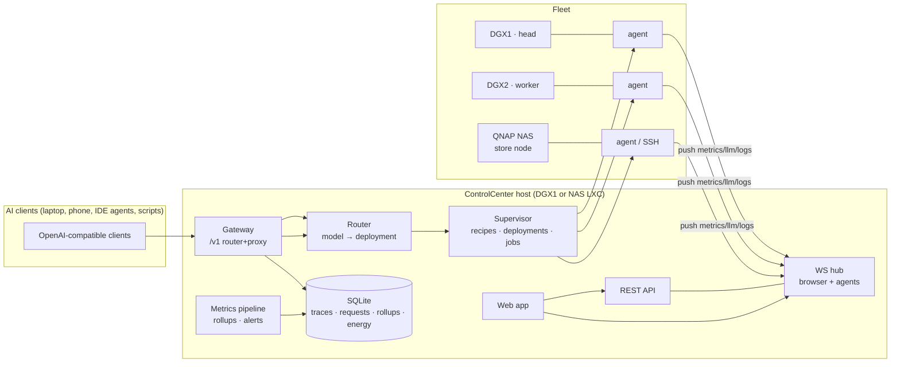

# ControlCenter — the control plane for a home LocalAI infrastructure

**Status:** Draft v1 for approval · **Author:** planning session 2026-09-23 · **Target repo:** `~/developer/controlcenter`

---

## 1. Vision

One web application that runs the entire home LocalAI stack: a 2× DGX Spark (GB10) cluster + a QNAP NAS.
ControlCenter is the **single pane of glass and the single API surface**:

- **Fleet** — register, monitor, and operate every node (metrics, health, power, shells-free operations).
- **Models** — a NAS-backed model store (modelctl) with placement to nodes: download, sync, push, remove.
- **Recipes → Deployments** — user-owned recipe folders/scripts that start inference engines; ControlCenter supervises them, on one node or a multi-node tensor-parallel pair, and serves **multiple models at the same time**.
- **Gateway** — one OpenAI-compatible endpoint in front of everything that is running, with per-client API keys, routing/failover, and **per-client, per-request performance telemetry** (TTFT, ITL, tok/s, tokens, latency, status, payloads).
- **Observability** — every metric obtainable from this infra, rolled up and chartable: system (GPU/CPU/UMA/thermal/network/storage), engine (vLLM/llama.cpp/SGLang/EXL3), request-level, energy, and cluster fabric.
- **Power** — underclocking profiles (CPU + GPU) for DGX units only: cool & quiet modes, thermal guards, schedules.

Non-goals (v1): multi-tenant RBAC, k8s/Helm deployment, cloud sync, mobile app, training/fine-tuning pipelines.

---

## 2. Grounding — what already exists and what carries over

Everything below was verified in the parent folder and upstream repos; it is the raw material this project consolidates.

### 2.1 sparkControl (fork of sparkDash, v1.8.6) — the functional baseline

| Capability | Where it lives today | Carry-over verdict |
|---|---|---|
| Node registry + hot config (add/edit/reorder units, roles head/worker/standalone, `kind: host`, `kind: nas`) | `server/sparks/SparkRegistry.js` | Re-implement (clean API, same UX ideas) |
| Metrics collectors (GPU/CPU/UMA/storage/network) local + SSH | `server/collectors/*`, `SparkMonitor.js` | Re-implement behind transport interface |
| LLM engine probes: llama.cpp, vLLM, sglang, ds4, EXL3; tok/s, KV cache, queues, TTFT/ITL p95 | `collectors/LlmProbe*` | Re-implement (this is gold — keep the detection matrix) |
| Reverse proxy + trace store (SQLite, caps, SSE tee, per-request records) | `server/proxy/llmProxy.js`, `TraceStore.js` | Evolve into the **Gateway** (F4) |
| Analysis UI (request list, detail modal, copy-as-curl, live follow) | `src/components/AnalysisPage` | Evolve (F5) |
| modelctl integration: NAS/node inventories, download/sync/push/delete, placement planning, doctor/repair, install job | `server/collectors/modelctlService.js`, `server/jobs/remoteJobs.js` | Port nearly 1:1 (F2, F8) |
| Serving scripts (env contract `MODEL_NAME`/`PORT`/`EXTRA_ARGS`, pidfile supervision) | `server/serving/serving.js` | Fold into deployments as the "script recipe" class (F3) |
| Serve/recipes: register recipe folders by node path, dispatch verbs `start.sh start\|stop\|status\|logs`, driver jobs, orphan/drift chips, placement bridge, capacity math | `server/serving/deployments.js` + README CH·01/CH·02 | Evolve: make recipes first-class + add router-backed deployments (F3) |
| Node agent (outbound WS, push metrics, jobs, serving supervision, token rotation, systemd bootstrap) | `agent/src/main.js`, `server/agent/*` | Evolve: same protocol ideas, versioned (F1) |
| Clock control: privileged `/usr/local/bin/spark-clock` helper, GPU `nvidia-smi -lgc`, CPU cpufreq cap, desired-state + reconcile-on-online, visudo-validated installer | `server/clocks/clockControl.js` | Port + add profiles/schedules/thermal guard (F6) |
| Energy tracking (fleet watt-hours), benchmarks (decode/prefill), showcase, ComfyUI/Hermes/Tailscale probes, WOL/shutdown, themes | `server/energy/*`, various | Port selectively (benchmarks become "workloads"; probes stay opt-in) |
| Frontend shell: hand-rolled routing, pill nav, panels, dialog system, Tailwind v4 | `src/*` | **Replaced** by the new design system (§9) — this fork's UX is functional but ad hoc |

### 2.2 modelctl (Python, uv) — the model-plane CLI

Verified surface we integrate (never bypass): `list --json [--root]` (NAS + `--local` node), `download` (HF → NAS, manifests, quantization selection, `queue … --jobs N`, `downloads.yaml`), `sync-local` (NAS→node, resumable rsync), `push` (node→node over CX7, repeatable `--host`, `--jobs`), `delete-local`, `delete` (NAS, dry-run + armed apply), `path`, `serve-command`, `doctor --json`, `repair-active --apply`, `catalog-refresh`, `update`. Store layout: `manifests/`, `models/`, `active/NAME` symlink, `catalog.json`, cards with `RUN.md`. **ControlCenter drives modelctl over SSH/agent; it never writes into the store itself.**

### 2.3 Recipes (user-owned folders, `~/developer/recipes/`)

Eight real recipes today: GLM-5.3-Flash-EXL3 (TP2 + experimental TP4), MiMo-V2.6-Flash, Qwen3.8-27B-NVFP4-DFlash2, Qwen3.8-Flash-Next (dual + single), DeepSeek-V4-Flash-DSpark (2-node Anemll/Stage-C compose stack), Laguna-S RTX-6000-PRO — each a folder with `start.sh` (dispatch verbs) + `.env` profiles (`.env.tp2`, `.env.tp4`, NCCL pins, EXTRA_ARGS conventions) and some with docker compose under the hood. **The contract ControlCenter relies on: `(node, path)`, entry script with verbs, `.env` profile files, declared ports, served model name.** The dashboard never edits recipes.

### 2.4 llama-swap (running today as systemd `--user` service)

`llama_sawp_config.yaml` maps model names → server start commands with `${PORT}` templating; llama-swap spins instances up/down on demand and proxies. `models.json` shows clients pointing at `127.0.0.1:8081/v1`. **Overlap decision (ADR-0004):** ControlCenter implements this swap/routing behavior natively in its Gateway (on-demand recipe-backed deployments + always-on deployments behind one endpoint), replacing llama-swap for fleet traffic; llama-swap stays usable standalone if wanted. See §6.4.

### 2.5 Hardware facts that shape features (verified)

- GB10 exposes **no user power-limit or fan control** (`nvidia-smi -pl` → `[N/A]`, firmware-managed). The working actuator is **`nvidia-smi --lock-gpu-clocks`** (range queryable via `--query-supported-clocks`); CPU control via cpufreq (`scaling_max_freq`/governor, wrapped by the `spark-clock` helper).
- Sustained-load thermal ceiling ≈ 83 °C is the practical constraint underclocking solves.
- Cluster fabric: CX7 QSFP ring, RoCE; NCCL interface/GID drift is a real operational pain the recipes already encode (`WORKER_NCCL_*`, GID auto-resolve).
- Community `spark_hwmon` (SPBM) driver exists for full-system power telemetry + power-limit control — integrate as **optional, opt-in** enhancement, never a dependency.

---

## 3. System architecture



**Components**

1. **`server/`** — Fastify (Node 22, TypeScript) control plane: REST, WS hub, gateway, supervisor, metrics pipeline, stores. Single process, modular by feature (`fleet/`, `models/`, `serving/`, `gateway/`, `metrics/`, `power/`, `jobs/`, `settings/`).
2. **`web/`** — React 19 + Vite SPA served by the same process; design system per §9.
3. **`agent/`** — per-node daemon, esbuild-bundled single `.mjs` (Node ≥18), **outbound WS** to the dashboard. Pushes metrics at configured cadences, runs detection LLM probes, executes jobs/serving supervision. SSH remains bootstrap + fallback (parity rule: every SSH op has an agent op).
4. **`shared/`** — TS types + zod schemas shared by server/web/agent (single source of truth for the WS protocol and API contracts).
5. **Stores** — SQLite (better-sqlite3, WAL): `requests`, `traces` (payloads, capped), `metrics_1m/1h/1d` rollups, `energy`, `clients`, `keys`, `jobs`, `alerts`. JSON configs (`config/*.json`) via `atomicWrite` for node registry, recipes registry, desired deployments, clock profiles.

**Transport rules (single-writer).** The agent is the **only runtime transport**: metrics, LLM probes, jobs, and serving supervision all flow over the agent's outbound WS — one code path, one writer per data source. SSH is **bootstrap/repair only** (install-agent, reinstall, clock-helper install) and read-only probes for declared-limited nodes (e.g. a NAS without an agent: storage/net only, visibly labeled `limited`). A node whose agent is not healthy is shown as `offline`/`degraded` — never silently half-reported via SSH scraping. Consistency is enforced by a server-side **reconciler** (desired state persisted in the DB; per-node tick + event-driven re-apply; explicit state enum).

---

## 4. Domain model

```
Fleet
 ├─ Node            id, name, kind: spark | gpu-host | nas, role: head | worker | standalone
 │                  addressing (lanIp, cx7Ip, sshUser/auth), llmPorts, agentState, transport
 ├─ ModelCatalog    NAS store models (name, runtime, bytes, manifest, cards) + per-node presence
 ├─ Recipe          (nodeId, path) · name · entry script + dispatch verbs · env profiles · ports
 │                  · servedModelName · multiNode declaration (NNODES/WORKER_IP) · git drift
 ├─ Deployment      id · recipe × node × port · kind: recipe | script | router-managed
 │                  · desired: running | stopped · state: stopped|starting|healthy|orphan|foreign|failed
 ├─ ServedModel     gateway alias → [deployments] (healthy-first) · onDemand policy · default?
 ├─ Client          name · apiKey (hash) · allowed models · rate/quotas (later) · firstSeen
 ├─ Request         ts · clientId · deployment · model · stream · status · ttftMs · durMs · e2eMs
 │                  · promptTokens · completionTokens · itl histogram · finishReason · error
 ├─ Trace           request payloads (capped 32 KB req / 64 KB res) · retention policy
 ├─ MetricSeries    per node/domain 1m → 1h → 1d rollups (avg/max/p95) · engine snapshots
 ├─ PowerSample      node watts (SPBM/dmon/wall-meter) → energy_1h|1d|1mo rollups (Wh/kWh, cost)
 ├─ ClockProfile    name · gpu {lock MHz | auto} · cpu {max kHz, governor} · scope: spark-only
 ├─ PowerPolicy     profile × node schedule · thermalGuard {tempC → auto-derate} · reapply on online
 ├─ Job             kind · target node · status · log ring · single-flight per node
 └─ AlertRule       metric condition · window · severity · channels (UI toast, webhook)
```

---

## 5. Feature specifications

### F1 — Fleet & node management
- Register nodes with kind + role; spark-only features (clocks, UMA panels, `nvidia-smi dmon` bandwidth) gated on `kind: spark`; NAS nodes get a store console instead of GPU panels (proven pattern from sparkControl).
- Node page: live panels (GPU incl. per-process VRAM, CPU, unified memory split + bandwidth, network, storage, thermal), uptime, transport badge (`Agent vX` / `SSH fallback` / `Agent offline`), actions: shutdown (armed), WOL, install/reinstall agent, connectivity test.
- Overview: fleet KPI strip (nodes online, models serving, requests/min, fleet tok/s, watts where known, alerts), per-node cards with live model chip (worker detection probes included), batch actions.

### F1a — Node-plane design rules (the rethink: resilient · maintainable · testable)

sparkControl's node layer is the pain point — dual SSH/agent implementations with a "parity rule", state truth from a 5 s probe-join, best-effort recovery, untyped settings. ControlCenter replaces each pattern:

**Resilient (runtime)**
- **Single writer per data path** (ADR-0002): the agent is the only runtime transport; SSH repairs it but never substitutes for it. A node without a healthy agent is *declared* `offline`/`degraded` — never silently half-reported.
- **Desired vs actual + reconciler**: the server persists desired per-node state (clock profile, desired deployments, cadences, agent version floor). A per-node reconciler (5 s tick + events: connect/reconnect/boot) computes drift and re-applies or flags it. Every entity maps to an explicit state enum: `provisioning | consistent | reconciling | drifted | degraded | offline` — surfaced on every card and header, no "implicitly fine".
- **Edge autonomy — server down ≠ fleet down**: engines keep running under node-level supervision (docker restart policies for compose recipes; systemd user units for process recipes), the agent re-applies the clock profile **locally on node boot** (no server round-trip), and a bounded local metric ring replays on reconnect with gap markers.
- **Sequenced atomic telemetry**: one atomic snapshot per tick per node (all domains + monotonic `seq` + per-domain `ts`). Server dedups/reorders by `seq`; staleness > 3× cadence ⇒ `degraded` + alert; replays insert gap markers so charts never blur "old" and "new".
- **Agent lifecycle hardening**: systemd `Restart=always` + `sd_notify` watchdog; handshake carries `proto` + `agentVersion`; server enforces a version floor and offers an upgrade job instead of breaking.
- **Durable control plane**: SQLite WAL + checkpointing, atomic desired-state writes, job recovery on boot (first-poll resolution), graceful shutdown flushes, node-down alerting on missed snapshots.

**Maintainable**
- **Contract-first**: all WS messages, REST payloads, and DB rows derive from zod schemas in `shared/` — protocol changes are compile errors, not runtime surprises. Settings/config get one typed schema with migrations (sparkControl's shallow-merge settings is the anti-pattern).
- **Modular monolith with ports & adapters**: `Transport`, `Collector`, `Supervisor`, `JobRunner`, `Store` are interfaces; feature modules (`fleet/`, `serving/`, `gateway/`, `metrics/`, `power/`) depend only on ports, enforced by lint boundaries. No cross-feature imports.
- **Versioned protocol with capability flags**: server tolerates any agent ≥ version floor; new features gate on capabilities — ends the "reinstall the agent after every dashboard change" loop.

**Testable**
- **`FakeNode`**: a first-class test double implementing the agent protocol — scripted metric series, fake LLM engines with deterministic SSE token timing, and **fault injection** (disconnects, latency, partial snapshots, duplicate/stale `seq`, watchdog timeout). Drives unit, integration, and CI tests with zero GPUs/SSH.
- **`--fake-fleet` dev mode**: the real server + web app boot against 3 simulated nodes + fake engines — full-stack demo and Playwright smoke on a laptop; the real fleet is only needed for the M-gates.
- **Deterministic time**: injectable clock for reconciler ticks, schedules, retention, and thermal-guard logic — no sleeping in tests.
- **Property tests for the risky edges**: shell quoting, probe parsers (five engine dialects), SSE tee caps, placement planner.
- **CI gates**: typecheck strict · eslint boundaries · vitest · c8 ≥ 75 % lines on `shared/`+`server/`+`agent/` **at every commit — the per-task coverage objective** · Playwright smoke on fake fleet · docs-check.

### F2 — Model catalog & placement (modelctl)
- **Models page**: NAS catalog master-detail (manifest details, serve-command copy, RUN.md, cards), HF download form + `downloads.yaml`-style queue, catalog refresh, doctor + two-click repair, modelctl version/update job.
- **Node presence matrix** (rows = models, columns = nodes): present/absent/stale chips with per-cell remediations **Sync from NAS** / **Push from peer (CX7)** / **Remove**; capacity math per transfer (free − reserve vs bytes) shown, warnings never block.
- `planPlacement(model, target)` → `present | sync | push(peer) | unavailable`; surfaced wherever a start needs a model (Serve page, Recipes page, API).

### F3 — Recipes & deployments (multi-model serving)
- **Recipes library**: register by `(node, absolute path)`; probe discovers entry variants (`start.sh`, `run.sh`, `docker-compose.yml`), dispatch verbs, `.env` profiles (presence-only — values never leave the node), ports, `MODEL`/`SERVED_MODEL_NAME`, NNODES/WORKER_IP for multi-node; re-probe, unregister; git drift chip (HEAD moved / dirty).
- **Deployments table** (Serve page): one row per recipe deployment + script-class runs + router-managed instances; start/restart/armed-stop; expandable console with **engine log** (dispatch `logs` verb / `docker logs`) and **driver log**; state machine `stopped → starting → healthy` (+ `orphan`, `foreign`, `drift`, `failed`); endpoints per row: DIRECT (node LAN) + PROXY (gateway).
- **Multi-model at once**: every deployment exposes its own port; the Router (F4) maps model aliases → deployments, so N models serve concurrently across both DGXs (e.g. 27B on DGX1 + 35B TP=2, or two small models); VRAM/UMA budget estimator warns before start (per-model footprint from manifest/observed), warnings never block.
- **Multi-node recipes**: start refuses with an exact-delta dialog unless declared worker matches configured cluster worker; the driver runs the recipe's own verbs (the dashboard does not generate serve commands — recipes remain user-owned).
- **Router-managed deployments** (llama-swap parity): define a ServedModel with an *on-demand* recipe + model; first request to the Gateway spins it up (with placement pre-check + capacity math), idle-timeout stops it. Always-on deployments bypass this.

### F4 — Gateway & proxy (the "be a proxy" feature)
- **One endpoint**: `http://controlcenter/v1` — OpenAI-compatible (`/chat/completions`, `/completions`, `/embeddings` passthrough, `/models` = live ServedModels). Works for OpenAI SDKs, IDE agents, anything with `base_url`.
- **Routing**: alias → healthy deployments (round-robin / least-loaded); per-model fallback chain (e.g. `gpt-local` → DGX1:8888 → DGX2:8888); on-demand spin-up for router-managed models; 404 with live served-name list for unknowns.
- **Auth & clients**: per-client API keys (create/revoke/scopes: allowed models); clients identified by key or (fallback) IP+reverse-DNS like today; dashboard-internal traffic (bench, showcase, playground) traced as source-tagged pseudo-clients.
- **Telemetry per request**: status, TTFT, e2e, ITL histogram (p50/p95/p99), prompt/completion tokens (real `usage`, estimated delta-count fallback flagged), stream vs not, model, deployment, client, error/finish reason; payload capture toggled with caps; one record per HTTP attempt including retry ladder. The Inspector offers **Copy-as-curl** (reconstructed request with the client's key redacted to a `$LLM_API_KEY` placeholder).
- **Auth injection**: stored per-deployment upstream key injected when client didn't send one (client header wins) — local engines typically keyless.
- **Resilience**: streaming pass-through untouched (SSE byte-fidelity), 300 s idle timeout, upstream failure → next deployment in chain (configurable) else 502 with recorded error; no WS upgrade handling (HTTP only).
- **CORS**: off by default; exact-origin allowlist setting; never `*`.
- **Per-client aggregation** (Analysis): tables + charts grouped by client / model / deployment / hour: requests, error rate, tok/s percentiles, TTFT p50/p95, tokens totals, est. energy per request (from node watts when available) — plus CSV export and a Prometheus `/metrics` exposition for the hobbyist's Grafana habit.

### F5 — Observability & metrics
- **Pipeline**: agent pushes domain snapshots (1–10 s cadences by domain) → in-memory ring for live UI + 1-minute samples → rolling rollups to `metrics_1h/1d` (avg/max/p95) → retention configurable (default 90 d rollups, 7 d raw).
- **Power consumption (DGX)**: per-node watt samples wherever a source exists (`spark_hwmon`/SPBM driver opt-in, `nvidia-smi dmon` estimates, or user-supplied wall-meter constant) → **hourly / daily / monthly Wh–kWh rollups** per node + fleet, charted and exportable; correlated with clock profiles (see F6) so "Cool saved X kWh this month" is a first-class answer. Optional €/kWh setting converts to cost.
- **Engine telemetry**: per-deployment probe with the sparkControl detection matrix (llama.cpp/vLLM/SGLang/ds4/EXL3): decode/prefill tok/s, cached vs uncached prefill, KV %, queue depth, TTFT/ITL p95, MTP accept rate where exposed.
- **Fleet views**: Overview KPIs + fleet-wide time ranges; **Energy** card (Wh/day, per node where SPBM/dmon data exists); **Fabric** panel for cluster links (CX7 link state, RoCE errors — best effort from node sysfs).
- **Alerts**: threshold + state rules over the metrics pipeline, with an explicit lifecycle — full spec in **F5a** below; ships at M6.

### F5a — Alerting (v1 scope, ships at M6)

Alerts **observe and route; they do not remediate**. Any corrective action lives in the Node / Serve UI, linked from the alert.

- **Rule model**: `{id, name, condition, window, severity: info|warning|critical, channels, enabled}`. Condition = metric expression over the live pipeline or node/deployment state (e.g. `node.unreachable ≥ 2 min`, `gpu.temp ≥ 64 °C for 15 min`, `deployment.state ≠ healthy while desired=running for 5 min`, `recipe.drift`, `store.free ≤ 200 GB for 30 min`, `gateway.5xx ≥ 2 % of requests over 10 min`). Seeded rules are read-only examples; rules are user-editable, capped at a sane max (50).
- **Evaluation**: server-side, on the same 1-minute rollup tick (+ event-driven for state conditions like node-down/recipe-drift). Deterministic, injectable-clock, covered by FakeNode fault injection.
- **Lifecycle**: `firing → acknowledged (optional, stamped who/when) → resolved` (auto when condition clears, manual with note otherwise); `muted` = suppressed window per rule or per entity (no re-fire while muted). All transitions land in `alert_events` (history + export CSV).
- **Delivery**: in-app toast + Alerts page; optional webhook per severity (generic JSON POST; no third-party integrations in v1).
- **Explicit non-goals (v1)**: no alert→action automation ("when temp high, apply Cool"), no escalation policies, no on-call/rotation, no external alerting services. The thermal **guard** (F6) is a node-level control, not an alert feature — the two are separate subsystems.

### F6 — Power & clocks (underclock, **DGX-only**)
- **Actuators (user-confirmed, both require sudo)**: GPU `sudo nvidia-smi -lgc <min>,<max>` (e.g. `0,2200`), revert `sudo nvidia-smi -rgc`; CPU per-core cap `echo <kHz> | sudo tee /sys/devices/system/cpu/cpu{0..19}/cpufreq/max_perf` (20 cores, e.g. `2000000` = 2.0 GHz). The dashboard never shells these directly — it drives a privileged helper (below).
- **Profiles** (seeded, editable): `Full` (GPU `-rgc`, CPU max_perf = hw max), `Cool` (GPU lock `0,2200`, CPU `2000000`), `Whisper` (GPU ~`0,1500`, CPU `1500000`), plus custom per-node profiles. Values resolved against `--query-supported-clocks` and per-core hw limits at apply time.
- **Apply path**: privileged `/usr/local/bin/spark-clock` helper installed by one job (sudoers validated `visudo -cf`, least-privilege: only the two verbs above) — ported from the proven sparkControl design; the agent invokes the helper, SSH fallback runs it over SSH.
- **Desired state + reconcile**: profile persists per node; re-applied automatically when a node transitions online (boot resets clocks).
- **Thermal guard**: if GPU temp > threshold for T seconds → auto-apply cooler profile (event recorded, reversible); guard configurable per node.
- **Schedules**: e.g. `Whisper` 23:00–07:00, `Full` otherwise; evaluated server-side per node TZ.
- **Gating**: profile UI + API 409 on `kind != spark` (community hwmon driver integration stays a documented opt-in, out of scope for core).
- **Node page Power card**: current clocks/temps/power (when visible), profile selector, apply status, last-applied stamp, guard/schedule editor, before/after tok/s note (manual benchmark hook from F7).

### F7 — Jobs, automation, ops
- Remote job layer (202 pattern): download/sync/push/delete/install-agent/install-clock-helper/update-modelctl; per-node single-flight 409; persisted transitions; boot recovery via first-poll resolution; live log tails; cancel (process-group kill).
- **Benchmarks as jobs** (from sparkControl, kept): decode sweep, prefill sweep — results pinned to deployment + clock profile, so "did underclocking cost me X tok/s" is answerable.
- Settings: capture toggles/caps, retention, gateway origins, NAS root, reserve-free-GiB, agent token rotation, SSH secrets (AES-256-GCM), config export/import (zip of `config/`), backup hint for SQLite files.

### F8 — Security model
- Dashboard: single-admin session (token → httpOnly cookie) enabled by default when bound beyond loopback (fixes sparkControl's "unauthenticated LAN" stance); loopback-only default bind retained.
- Agent: outbound-only WS, 64-hex token (secretsStore, rotatable, hot re-auth), first-message handshake with proto version.
- Gateway clients: hashed keys, per-client model allowlist; keys never logged; payload capture respects a redact-list setting (e.g. strip `api_key` fields).
- Secrets: SSH passwords AES-256-GCM at rest; no secrets in API responses (presence-only probes for recipe `.env`).

---

## 6. Key design decisions (ADR seeds)

| ADR | Decision | Rationale / rejected alternative |
|---|---|---|
| 0001 | **TypeScript everywhere (server+web+agent), Fastify** | One language across 3 components, shared zod contracts, reuse of proven JS collector logic from sparkControl. Rejected: Go agent + TS server (two toolchains for a 1-person project); Python server (would orphan the WS/agent investment). |
| 0002 | **Agent-only runtime transport; SSH = bootstrap/repair only** | sparkControl's dual-path (SSH collectors + agent push with a "parity rule") means two implementations of every node function — the root cause of inconsistent freshness, shapes, and behavior. One writer per data path removes that bug class; a node without a healthy agent is *declared* degraded/offline (visible, alerted) instead of silently half-reported, and auto-repaired via the SSH install job. Tradeoff accepted: visibility depends on agent health — mitigated by systemd `Restart=always` + watchdog, auto-repair, and node-down alerts. |
| 0003 | **Local file-backed SQLite (better-sqlite3, WAL) from day one; JSON files for config** | Persistence starts as a **local database on the filesystem** — a single `.db` file under the config volume, zero external services, survives restarts and container rebuilds; scales fine for a homelab fleet. Rejected: Postgres (server ops), DuckDB (write pattern), starting fileless/ring-buffers-only (loses history across restarts). |
| 0004 | **Gateway routing native in server; llama-swap not required** | Per-client keys + per-request telemetry + placement checks need deep integration llama-swap can't expose; swap behavior (on-demand, idle-stop) is ~1 module. Rejected: proxy to llama-swap (double-proxy latency, no client identity). |
| 0005 | **Recipes stay user-owned files; dashboard supervises, never generates** | Same contract as sparkControl Serve; users keep git-versioned recipes; dashboard adds state/placement/telemetry. |
| 0006 | **Clocks via `-lgc` + cpufreq helper; no nvpmodel/pl dependencies** | GB10 firmware exposes no pl/fan; `-lgc` is the documented-working lever. |
| 0007 | **REST + WS (no tRPC/gRPC)** | Gateway itself is REST; browser needs WS pushes; keeps API contract-observable (OpenAPI generated from zod). |
| 0008 | **Design system: bespoke tokens on Tailwind v4 + Radix/shadcn primitives ("Pulse DS", enterprise blue · light-first · airy)** | Full visual control with accessible behavior primitives; direction user-approved. Rejected: MUI (visual homogenity, heavy), full hand-rolled (sparkControl proved the a11y/dialog tax). |

---

## 7. Data & API surface (v1 sketch)

REST (all under `/api`, session-auth): `nodes` CRUD + `/nodes/:id/actions/{shutdown,wol,test,install-agent,install-clock-helper}`, `nodes/:id/metrics?range=`, `nodes/:id/power` (profile get/set, guard, schedule), `models/nas`, `nodes/:id/models`, `placement?model&node`, `jobs` (+ kinds above), `recipes` CRUD/probe, `deployments` CRUD + `/:id/{start,stop,restart,logs}`, `served-models` CRUD, `gateway/clients` + keys, `requests?groupby=client|model|deployment&since&until`, `requests/:id`, `traces/:id`, `metrics/fleet?range=`, `energy`, `alerts` CRUD + history, `settings`, `system/{version,backup}`.

Gateway (key-auth): `/v1/*` passthrough + `/v1/models`; admin: `/metrics` (Prometheus).

WS channels: browser `/ws` (snapshot + deltas, one-way pushes), agent `/agent-ws` (hello/welcome handshake, `metrics`, `llm`, `job-out/exit`, `serve-log`, `resp`; dash→agent `job-run/kill`, `serve`, `config-update`, `ping`).

SQLite tables: `requests`, `traces`, `clients`, `api_keys`, `deployments_state`, `jobs`, `metrics_1m|1h|1d`, `engine_snapshots`, `power_samples`, `energy_1h|1d|1mo`, `alerts`, `alert_events`. Config JSON: `nodes.json`, `recipes.json`, `deployments.json` (desired), `served-models.json`, `clock-profiles.json`, `power-policies.json`, `settings.json`.

---

## 8. Repository setup with agentic-bootstrap (explicit step plan)

The repo is initialized **empty-first, then bootstrapped** so agentic-bootstrap owns its scaffolding:

```bash
mkdir -p ~/developer/controlcenter && cd ~/developer/controlcenter
git init
# one-time tool install
cd ~/developer/agentic-bootstrap && python3 -m pip install -e .   # or: uv tool install .
cd ~/developer/controlcenter

# 1) confirm answers file (below) → preview → apply
agentic-bootstrap init --answers answers.json --dry-run --yes --target .
agentic-bootstrap init --answers answers.json --yes --target .
agentic-bootstrap validate --target .

# 2) generate the agent-guided proposal for the implementation phases (optional lane)
agentic-bootstrap inspect --target .
```

`answers.json` (kept credential-free):

```json
{
  "project": {
    "name": "controlcenter",
    "description": "Control plane for a home LocalAI infrastructure: DGX Spark cluster + NAS model store, recipe-based serving, OpenAI-compatible gateway with per-client telemetry, and power management.",
    "build_command": "npm run build",
    "test_command": "npm test",
    "run_command": "npm run dev",
    "ticket_prefix": "CC"
  },
  "features": {
    "platforms": ["claude", "codex", "pi", "opencode"],
    "mcp": true,
    "agents": true,
    "github": true,
    "scheduled_audit": true,
    "hooks": true
  }
}
```

What this establishes (and why it matters here):
- **Provider-neutral agent instructions** (`AGENTS.md`, `CLAUDE.md`, `.agents/skills/*`, `.claude/skills/*`, `.opencode/commands/*`) — so any of the user's coding agents works from the same ground truth.
- **ADR lifecycle** (`docs/adr/` + `architecture-decision` skill) — §6 seeds become ADR-0001…0008 at M0.
- **docs-check** (`.agentic/bin/docs-check`, GitHub workflow, weekly `--scheduled-audit`) — keeps PLAN/README/API docs from rotting as the surface grows.
- **Git hooks** (`--hooks`) — pre-commit typecheck/lint gate.
- **Semantic-versioning skill + CHANGELOG discipline** — releases cut per milestone.

Engineering best-practices baseline on top: strict TS, ESLint (typescript-eslint) + Prettier, `zod` schemas as single contract source, conventional commits, CI = `docs-check + typecheck + lint + test + coverage gate (c8 ≥75% on server/agent)` + Playwright smoke on a seeded fixture fleet, trunk-based with short-lived branches, `docs/` for RUNbooks (agent install, NAS mount, NCCL pins, gateway onboarding per client).

---

## 9. Design system — "Pulse" (enterprise, light-first)

Full spec + visual mockups in [`design/mockups/`](design/mockups/index.html) (screenshots presented for approval). Direction approved by user: **Option C "Slate Pro"** — enterprise blue accent · light-first · airy executive density · **mobile-first** responsive.

- **Mood**: calm enterprise console — white cards on a soft gray canvas, one muted blue accent, color reserved for meaning (states, chart series), generous whitespace, clear hierarchy. A dark theme ships as an equal token map, toggled in Settings; no glow, no animated noise, no decoration that isn't information.
- **Tokens** (CSS custom properties, Tailwind v4 `@theme`): canvas `#f6f7f9`; cards `#ffffff` with hairline borders `rgba(15,23,42,.08)`; text `#1a2233 / #5b667a / #8b95a7`; accent `#3b6ff5` (interactive only: primary buttons, links, focus, active nav); semantic `ok/warn/crit/info` as tinted pills (solid color text on 8–12 % tint backgrounds); chart series = restrained blue–slate ramp (+ amber for thermal, red only for errors); radii `8/10/12`; spacing on an 8-px grid with **24-px page gutters and 20-px card gaps**; type 14 px body Inter, 13 px tables, 11 px uppercase labels, JetBrains Mono only for numerics/logs.
- **Density contract (airy executive)**: max **4 KPIs + 2 primary panels** per view; one chart per panel; depth lives in the **Inspector drawer** (requests, node drill-downs, job logs) — never in stacking more panels; compact mode deferred (same tokens, later toggle).
- **Core components**: `Panel`, `Metric` (label+value+delta+optional muted sparkline), `LineChart` (uPlot, muted palette, hairline grid), `StatusPill`, `Chip`, `DataTable` (TanStack, sticky header, pinning, virtualized), `Inspector` drawer, `ConsoleLog`, `CommandPalette` (⌘K), `ArmedButton` (two-step destructive: solid red, no animation), Radix-based forms, `Toast`, `Skeleton`, `EmptyState`, `KeyChip`, clock sliders.
- **Signature patterns**: live-everything over WS (no refresh), Inspector drawer for drill-in, placement matrix, armed destructive for power/deletion, keyboard-first nav, WCAG AA contrast on both themes, `prefers-reduced-motion` respected.

---

## 10. Framework / tool debate

| Layer | Recommendation | Why it wins here | Backups (tradeoffs) |
|---|---|---|---|
| Server runtime | **Node 22 + TypeScript + Fastify** | Shares one language/contracts across server+agent+web; sparkControl's collectors/proxy logic is JS and proven; Fastify = schema-validated, faster than Express 5, plugin DI for tests | NestJS (structure but heavy DI ceremony for a solo project); Express 5 (already known, but weaker schema story); Python FastAPI (modelctl affinity, but duplicates the entire agent/WS investment); Go (single-binary agents, but 2× toolchain + slower iteration for dashboard features) |
| Web framework | **React 19 + Vite + TS** | Team-of-one continuity, largest ecosystem for dashboards, sparkControl tests/components port conceptually | SvelteKit (ergonomics, smaller metric-chart ecosystem); SolidStart (perf, niche); Next.js (SSR unneeded — this is an appliance SPA) |
| UI primitives | **shadcn/ui (Radix) + Tailwind v4** | Accessible primitives, copy-in ownership (forkable), fits bespoke token design | MUI (fast but visually opinionated); HeroUI; fully hand-rolled (sparkControl paid the dialog/focus-trap tax already) |
| Charts | **uPlot** (dense time-series) + **Recharts** (composed/one-off viz) | uPlot renders 100k-point series at 60 fps (metrics wall); Recharts for donut/bar compositions | visx (flexible, more code); ECharts (powerful, big bundle); Chart.js (weaker perf) |
| Data/state | **TanStack Query + zustand** + native WS store | Server-state caching/invalidation solved; tiny client state | Jotai/Redux (unnecessary); raw context (sparkControl showed the scaling pain) |
| Tables | **TanStack Table** | Matrix + requests tables need pinning/virtualization/grouping | AG Grid (heavy/licensing) |
| Validation/contracts | **zod** (shared `shared/` package) → OpenAPI via zod-to-openapi | One schema powers runtime validation, TS types, API docs, gateway client SDK | TypeBox; io-ts (ergonomics) |
| DB access | **better-sqlite3** (WAL) | Sync, fast, transactional; simplest correct choice for single-process | node:sqlite (zero-dep, less mature tooling); Drizzle on top for migrations ergonomics (adopt if schema churn hurts) |
| Agent | **Node ≥18 single-file esbuild bundle** | Reuses collectors verbatim; sparkControl's install flow proven (Node tarball → systemd unit) | Go agent (2–3 MB binary, no runtime — adopt if node-tarball bootstrap ever becomes the pain point); Rust (overkill) |
| Process supervision | **Agent `child_process` + detached driver jobs + pidfiles** | Survives dashboard restarts, works over SSH fallback identically | systemd D-Bus integration (cleaner but Linux-desktop-coupled + sudo surface) |
| E2E | **Playwright** (seeded fixture fleet, fake engines) | Tests gateway routing/deployments without GPUs | Cypress (weaker multi-context) |
| Lint/format/CI | **typescript-eslint + Prettier + GitHub Actions** (`docs-check`, `typecheck`, `test`, `coverage ≥75 %`, `build:agent`, Playwright smoke) | Enforced by agentic-bootstrap hooks/workflows | Biome (faster, younger) |

---

## 11. Execution plan (milestones with gates)

**Quality contract (applies to every task in §11).** Each task ships with its tests in the same change; the c8/vitest gate enforces **≥75 % line coverage on `shared/` + `server/` + `agent/` for the merged tree at every commit** (pre-commit + CI run it), so any task whose new code drops the tree below 75 % fails its own acceptance — coverage is per-task by construction, not a phase-end cleanup. Web logic (stores, parsers, clients) follows the same rule via vitest from M1; pure-render UI is exercised by the Playwright fake-fleet smoke (M7). Gates below are in addition to this standing rule.

Each milestone ends in a **gate** — demoable behavior + tests green.

- **M0 — Bootstrap (½ day).** agentic-bootstrap init (+answers above), ADRs 0001–0008 written, pnpm/npm workspace skeleton (`server`, `web`, `agent`, `shared`), toolchain + CI + hooks, Dockerfiles + compose, `docs/RUNBOOKS.md` seeds. *Gate: CI green on hello-world endpoints; `agentic-bootstrap validate` passes.*
- **M1 — Fleet core (1 wk).** Node registry + typed settings/secrets; **`shared/` protocol schemas + `FakeNode`/`--fake-fleet` harness built first**; agent daemon + `/agent-ws` (handshake, watchdog, seq'd atomic snapshots); SSH bootstrap (install-agent job only); collectors; WS hub; Overview + Node pages with reconciler state enum; SQLite + rollups. *Gate: fake-fleet demo drives the full UI with fault injection (kill agent → `degraded`, replay with gap markers); reconciler re-applies clock profile after simulated node boot; real DGX1+DGX2 live via agent with <2 s freshness.*
- **M2 — Model plane (1 wk).** modelctl service (inventories, caches, stale semantics), jobs layer (download/sync/push/delete/install), placement planner + capacity math, Models page (catalog, matrix, queue, doctor). *Gate: download→sync→start-visible-on-node flow end-to-end on real NAS+DGX.*
- **M3 — Serving (1–1.5 wk).** Recipes registry + probe; deployments supervisor (recipe + script classes); Serve page; multi-node guard; VRAM budget estimator; gateway pass-through per deployment (`/llm/node/:id/:port`). *Gate: GLM TP=2 recipe deployed from UI; two single-node models running concurrently; armed-stop + orphan recovery after dashboard restart.* **Gate outcome (2026-09-23):** recipe probe verified on the real GLM folder (verbs/variants/containers/.env, secrets presence-only); serve lifecycle proven end-to-end on the real agent channel with a scratch engine (register→probe→deploy→start→healthy→pass-through→stop→stopped) concurrent with the untouched GLM engine on 8081; orphan recovery after dashboard restart verified (records survive in config/, state re-derived); TP=2 start deferred by owner decision (would replace the sparkControl-served GLM engine on 8081).
- **M4 — Gateway & Analysis (1–1.5 wk).** Router (`served-models`, alias→deployments, healthy-first, fallback), on-demand spin-up/idle-stop, per-client keys, request recorder (TTFT/ITL/tokens/est-flag), traces + Inspector drawer, Analysis page (per-client/model/deployment aggregation + CSV + Prometheus endpoint). *Gate: llama-swap config's model set reproduced as served-models; two clients keyed separately; per-client charts populate from real traffic; failover drill passes.* **Gate outcome (2026-09-23):** live on the real fleet — keyed client → gateway alias `glm-live` → routed to the real GLM engine on dgx1:8081 (alias rewritten to upstream id, completion 'OK' returned, usage 52 completion tokens recorded); model set swapped live over REST (create/delete served models); failover drill: dead-target 502 recorded with full attempts trail and errorRate KPIs; healthy-first ranking verified against live deployment state; Prometheus + CSV + Analysis API live; traces store with caps/redact/retention under SQLite migration 2.
- **M5 — Power & clocks (3–4 d).** spark-clock helper installer, profiles + apply/reconcile, thermal guard, schedules, Node Power card, benchmark-before/after hook. **User-verified control surface (DGX Spark GB10):** GPU cap via `sudo nvidia-smi -lgc 0,2200` (lock GPC clock range; verify `nvidia-smi -q -d CLOCK`); CPU cap via `sudo cpupower frequency-set -u 2000MHz` (driver `cppc_cpufreq`, hw limits 338 MHz–2.81 GHz, governors conservative/ondemand/userspace/powersave/performance/schedutil; verify `cpupower frequency-info`). Agent runs these through sudoers NOPASSWD entries scoped to exactly these two commands; boot reconcile re-applies the last profile (node boot resets clocks). Profiles: `full` (no cap), `eco` (GPU ≤2200 MHz + CPU ≤2.0 GHz), `quiet` (GPU ≤1800 MHz + CPU ≤1.5 GHz). *Gate: profile apply on DGX1 survives reboot via reconcile; thermal guard triggers on synthetic temp; non-spark node → 409.* **Gate outcome (2026-09-24):** spark-only 409 + reboot reconcile (agent boot re-apply without dashboard) + thermal auto-derate/recover hysteresis proven by tests; live evidence on the fleet — profiles set/restore through the reconciler (eco → resolved 2200/2000 caps → full reset), thermal nominal on both DGXs, energy accounting reading real GPU watts (0.4487 kWh / 24 h), schedules evaluated in node timezones. Live clock apply awaits the one-time cc-clock sudoers install (manual two-line step documented in docs/DEVELOPMENT_STATUS.md and emitted by the installer job).
- **M6 — Observability depth (1 wk).** Alerts engine + channels, **Energy page (hourly/daily/monthly power & cost)**, Fabric panel, benchmarks-as-jobs UI, fleet time-range explorer. *Gate: alert fires on pulled agent cable; kWh rollups populate from watt samples.*
- **M7 — Hardening & release (½–1 wk).** Backup/export, RUNBOOKS complete (agent, NAS, NCCL, client onboarding), Playwright suite, docs-check clean, coverage gate, v1.0.0 tag via semver skill. *Gate: fresh-machine install from README to first request < 30 min.*
- **M8 — Chat UI (open-webui-class experience, final milestone).** Chat with any served model from the dashboard: conversation list + **folders that act as project context** (folder description injected into every conversation prompt), streaming markdown responses, conversation persistence in SQLite, **image attachments** routed to vision-capable deployments. Gateway telemetry applies — every chat request is a client like any other. *Gate: chat end-to-end with a served model; folder context persists and is injected; image attachment reaches a vision model.*

**Sequencing notes:** M2/M3 internals depend only on M1 transport; M4 depends on M3 (targets exist) but its proxy core can start early (port of `llmProxy.js`); frontend builds continuously per milestone on the Pulse DS — no big-bang UI phase.

**Risks & mitigations:** GB10 firmware changes to `-lgc` behavior (feature-detect + degrade to read-only); SQLite growth (retention + rollups from day one, `wal_checkpoint`); agent security surface (outbound-only, token rotation, no shell-by-default jobs); NCCL ring drift on multi-node recipes (recipes own it; dashboard surfaces pins in probe); single-host dashboard SPOF (accept — NAS LXC fallback documented); Docker networking for gateway (host networking like sparkControl, documented).

---

## 12. Decision log (resolved)

1. **Design system** — ✅ approved: **Option C "Slate Pro"** (enterprise blue, light-first, airy executive, mobile-first; dark theme as equal token map). Chooser + A/B kept in `design/mockups/` for reference.
2. **Stack** — ✅ approved: **Node 22 + TypeScript + Fastify** monorepo (`server` / `web` / `agent` / `shared`); backups recorded in §10.
3. **Gateway strategy** — ✅ approved: **native router in server** (ADR-0004); llama-swap is superseded for fleet traffic and stays usable standalone.
4. **Persistence** — ✅ confirmed: **local file-backed SQLite from day one** (ADR-0003); no external DB services.
5. **Clocking** — ✅ user-confirmed actuators: `nvidia-smi -lgc <min>,<max>` / `-rgc` (GPU) and per-core `cpufreq/max_perf` (CPU), sudo-gated helper (F6).
6. **Power telemetry** — ✅ required: hourly/daily/monthly kWh rollups per node + fleet, cost optional (F5).
7. **Serving model** — recipes-only (user-owned scripts, ADR-0005); template generator deferred unless requested.
8. **Node plane** — ✅ redesigned per F1a: single-writer agent transport (ADR-0002), desired-state reconciler with explicit node state enum, edge autonomy, sequenced telemetry, `FakeNode`/`--fake-fleet` test harness; sparkControl's dual-path SSH+agent parity model is retired.
9. **Alerting scope** — ✅ per F5a (M6): rules + lifecycle + toast/webhook only; **no alert→auto-remediation wiring in v1** (thermal guard remains a separate node-level control); mockups reconciled (Overview alerts panel removed; Alerts page links to remediation UIs).
10. **Chat UI (M8)** — open-webui-class chat as the final functionality: conversations in folders (folder = project context injected into prompts), image attachments routed to vision-capable deployments, streaming over the native gateway so all chat traffic is captured by the same per-client telemetry.
